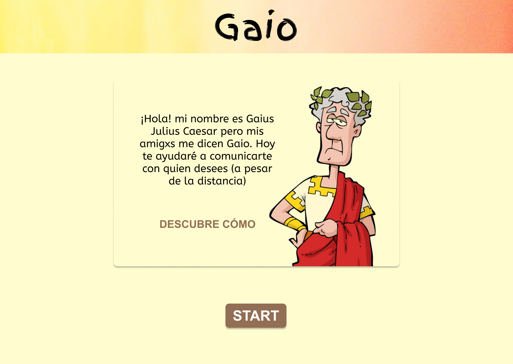

# GAIO

## Índice

* [1. Introducción](#1-introducción)
* [2. Resumen del proyecto](#2-resumen-del-proyecto)
* [3. Producto final](#3-producto-final)
* [4. Investigación UX](#4-investigación-ux)

***

## 1. Introducción

"Gaio" es una aplicación web de mensajería, cuya dinámica se basa en el [cifrado César](https://en.wikipedia.org/wiki/Caesar_cipher), un método para encriptar mensajes. Para poder disfrutar de la experiencia que "Gaio" brinda, se debe de acceder a través del siguiente enlace https://mayraperez97.github.io/LIM013-cipher/src/index.html#

## 2. Resumen del proyecto
"Gaio" se desarrolla como una propuesta amigable y lúdica, cuyo objetivo es unir más los vínculos (de cualquier índole) entre las personas, en un contexto caracterizado por el aislamiento social. Para ello, consta de tres páginas:

1. Bienvenida
2. Cifrado/descifrado
3. Mensaje final

## 3. Producto final

### Pantalla de bienvenida

* Introduce al usuario y explica cómo se realizará la dinámica.
* Incluye una ventana modal para ello.

### Pantalla cifrado/descifrado

* Solicita 2 datos necesarios para ejecutar el mensaje encriptado/desencriptado: offset y texto.
* Adicionalmente, cuenta con un botón para borrar lo ingresado en el campo "ingrese su mensaje".

### Pantalla mensaje final

* Pantalla donde se imprime el mensaje final, es decir, encriptado o desencriptado.
* Contiene un botón para copiar el mensaje final.

## 4. Investigación UX

1. Users: 
Amigos, familiares o personas con cualquier vínculo en común (en especial si son de pocas palabras).

2. User-Product aims:
* Superar la brecha del distanciamiento social.
* Fortalecer vínculos afectivos.
* Soporte emocional durante la pandemia.

3. Problema identificado:
Distanciamiento social

4. Solución del producto:
A través de un mensaje cifrado se puede expresar un sentimiento hacia alguien que se estima de forma más sencilla porque a veces es dícifil expresarlo directamente, mucho más cuando estamos separados.

5. Desarrollo de prototipo:
* Feedback: inicialmente la idea no fue plasmada en papel; no obstante, a través de videollamada fue explicada a algunas compañeras, quienes fueron indicando si estaban de acuerdo o en desacuerdo, simultáneamente a ello me sugerían más ideas.

* Sin embargo, se utilizó figma para esbozar el posible diseño de la página, las siguientes imágenes muestran este resultado:

